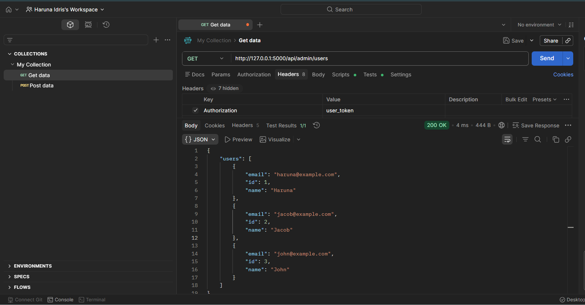
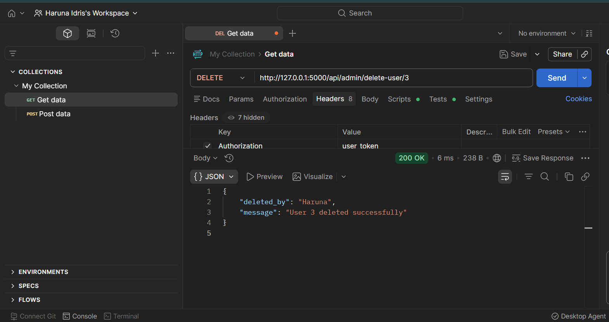
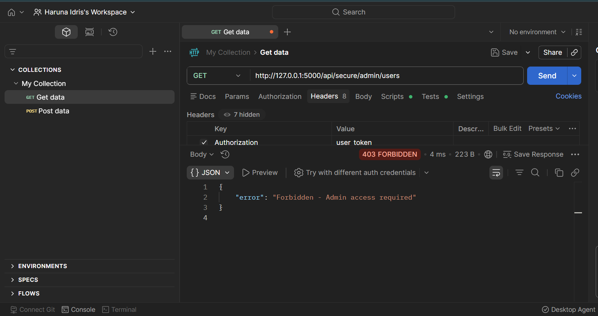

# BFLA - Broken Function Level Authorization | API Security Lab

## What is BFLA?
Broken Function Level Authorization (BFLA) is a critical API vulnerability 
ranked in the OWASP API Security Top 10. It occurs when an API fails to 
properly restrict access to sensitive functions based on the user's role. 
This allows regular users to access admin-only endpoints and perform 
privileged actions they should never be allowed to do.

## Lab Overview
In this lab I built a vulnerable REST API using Python Flask that simulates 
a real-world BFLA vulnerability. I then exploited it as a regular user to 
access admin functions, and finally implemented a secure version that 
properly enforces role-based access control.

## Tools Used
- Python 3
- Flask
- Postman

## User Roles Simulated
| Token | Role | Expected Access |
|---|---|---|
| user_token | Regular User | Own data only |
| admin_token | Admin | All data + admin functions |

## Vulnerable Endpoints
| Method | Endpoint | Should Be |
|---|---|---|
| GET | /api/admin/users | Admin only |
| DELETE | /api/admin/delete-user/<id> | Admin only |

---

## Attack 1 — Regular User Reads Admin Data

**Request:**
- Method: GET
- URL: http://127.0.0.1:5000/api/admin/users
- Header: Authorization: user_token

**Result: 200 OK**

A regular user successfully retrieved all users and their 
email addresses from an admin-only endpoint.

**Why it happened:**
The endpoint only checked if the user was authenticated 
(token exists) but never checked if the user had admin role.

---

## Attack 2 — Regular User Deletes Another User

**Request:**
- Method: DELETE
- URL: http://127.0.0.1:5000/api/admin/delete-user/3
- Header: Authorization: user_token

**Result: 200 OK — "User 3 deleted successfully" — deleted_by: Haruna**

A regular user successfully deleted another user's account 
without any admin privileges.

**Why it happened:**
Same root cause — no role-based check on a destructive 
admin function.

---

## The Fix — Role-Based Access Control

**Request:**
- Method: GET
- URL: http://127.0.0.1:5000/api/secure/admin/users
- Header: Authorization: user_token

**Result: 403 Forbidden — "Forbidden - Admin access required"**

The secure endpoint properly checked the user's role before 
allowing access and blocked the regular user immediately.

**How it was fixed:**
``python
if user["role"] != "admin":
    return jsonify({"error": "Forbidden - Admin access required"}), 403
`

Always verify the user's role, not just their identity.

---

## Real World Impact
If this vulnerability exists in a production API:
- Any authenticated user can access all other users' private data
- Any authenticated user can delete, modify or escalate accounts
- An attacker can enumerate and wipe an entire user database
- Sensitive admin operations become available to everyone

## Key Lesson
**Authentication** confirms who you are.  
**Authorization** confirms what you are allowed to do.  
BFLA happens when APIs only check authentication but skip authorization.

## Remediation
- Always implement role-based access control (RBAC) on every endpoint
- Never rely on endpoint obscurity for security
- Apply the principle of least privilege — users get only what they need
- Test every admin endpoint with a regular user token before deploying

## References
- [OWASP API Security Top 10](https://owasp.org/API-Security/)
- [OWASP BFLA](https://owasp.org/API-Security/editions/2023/en/0xa5-broken-function-level-authorization/)
